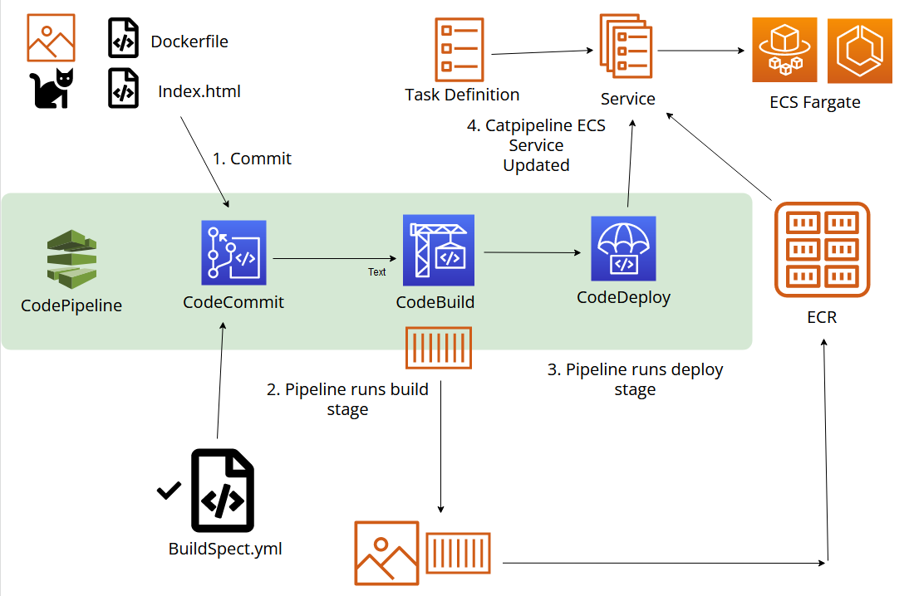

# CatCodePipeLine
 AWS CodePipeline

## Stages

1. **STAGE 1**: Configure Security & Create a CodeCommit Repo
2. **STAGE 2**: Codebuild repo cloned, created cotainer image to store on ECR.
3. **STAGE 3**: Config codepipeline with comit and build steps to automate build on comit.
4. **STAGE 4**: Created ECS Cluster, TG, ABL and configured the codepipeline for deployment to ECS Fargate. 
5. **STAGE 5**: Deployed to ECS Fargate.

## Architecture

STAGE 1 : Configure Security & Create a CodeCommit Repo
